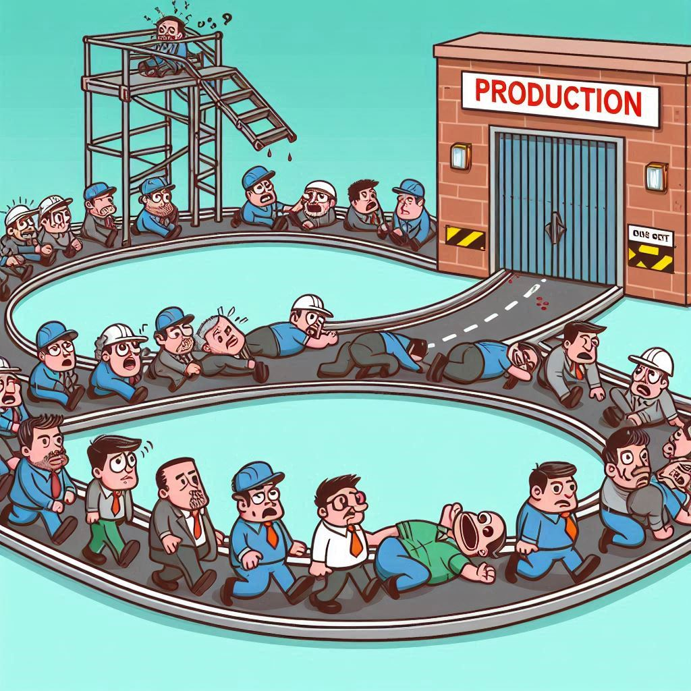

## The Challenges of Information Currency

I recently found myself searching for a nugget of technical information related to Prometheus, although the specifics are rather pedestrian to this discussion.  The function I needed to implement for a client wasn't seemingly obscure although it hadn't been available in early versions of the product: time based alert routing options such that certain alerts would be treated differently based purely on time of day.  There were numerous articles, blogs and technical forums with a variety of solutions including code snippets to address this requirement.  Thoughtful of technical folk to take there valuable time to post these ideas.  The only trouble was: none of the code works with the current version and so the various web pages were of little value in solving my requirement.

Now I am in no way implying that these generous souls were/are under any social contract to keep re-visiting their posts following testing each new release from the vendor.  Nor am I insinuating that the vendor failed in some way.  In the software world we use the word deprecated to describe a feature or function or method that previously was available but has been replaced or even eliminated altogether.

 And this is the nature of the beast, progress means coming to some consensus by the supplier of software, be it a commercial enterprise or a band of open source developers, to define and refine the features/APIs, etc. that will survive and which will be removed as the software evolves.  This is required by any who would be good stewards of the code base. These decisions, of course, come with ramifications for those who wish (or in the case of commercial software may be required) to use the updated version.  The result tends toward requiring some change in the manner of interacting with the software: the way the payroll software presents the person interface has subtly (suddenly?) changed.  The library a developer wrote her code to work against doesn't compile anymore.  The systems engineer's ansible playbook yaml fails to deploy following an ansible release.

 Suppliers of software may provide release notes to indicate significant changes.  Well funded suppliers may update entire document streams to account for these changes and, ideally, link the version of the documents to the version of the software.

In other cases, there may be other documentation that articulates the changes.  This can be a single document "pack", other times a version release is a collection of bug fixes that have separate associated issues or tickets.  Unfortunately, sometimes there is very little in the way of documentation released along with a version.

One result of the 'move fast and break things' methodology is version releases arrive more quickly than some segment of the user base can consume the documentation and modify their usage of the code or system to correspond with the release flow.  In the traditional enterprise Information Technology department of yesteryear, the approach was simple: the release to production of any code (vendor or in house) went through a "rigorous" test cycle.  If the software interacted with any other software, all the permutations needed to be properly identified, documented, tested.  A detailed and tested rollback plan may be developed alongside the rollback plan.  And a version change to a major piece of software in the enterprise may only be considered a few times a year at most.

So on the one hand we have the rapidfire, "small" release cycle from software vendors being received by traditional enterprises capable of precious few deployment cycles.  Now, one could argue that the dinosaurs needed to be, shall we kindly say 'culled from the herd.'  And few could successfully argue that maintaining IT practices in general from the eighties and nineties would serve the industry indefinitely.

Aside from the sheer duration that a deployment to production took, it meant Senior Managers/Associate VPs could explain away the cost to VPs as evidence of rigor.  And the VPs could in turn speak reassuring words to the Ps who could salve the C suite, who did their job to powerpoint the Board into calm reassurance.  Because no one wanted to be the one to have to quote the press release that the Marketing/Optics team wrote explaining why the critical customer facing system took an unplanned outage during business hours.  Because Production was a sacred icon, to be revered and respected.

One could rightly infer that deploying a version upgrade to production was a messy, expensive proposal, fraught with many fatal pitfalls and dangers lurking around every bend.  Many a decomposing body lay on the path, dead by either negligence or political malice.

This was not the path of younger enterprises driven by entrepreneurial hutzpa, where production was a malleable object to be reincarnated with every week or even day a new creation.  In these orgs it was often a case of smaller releases, smaller deployments and even before the days of Continuous Integration.

So, yes, I just wrote paragraphs of text to poorly summarize agile versus traditional IT.  And you may be of the opinion that the Internet is all the poorer for it.  But the point (at least as it relates to this discussion) is: there are lots of docs describing past, present and future code releases of all kinds of software floating around the Internet.  And there is lots of it, everywhere.  Search engines will gladly provide pages of links to documents for all kinds of software.  Some of those documents may be related to the version you are struggling to deploy, manage, patch, use or otherwise interact with in some manner.

And that's a problem.  Some people may be running older versions and want to or even need to keep doing so.  They may even have to deploy an old version because of some technical or political reason, like acquisitions or because Frank was the only guy who knew how this goofy thing worked and Frank left the company last year as part of that 'cost cutting' exercise.

Others have the current version and need to configure something a little outside the norm or just didn't catch early enough in their internal testing that this software needs to communicate with that software over there and the interaction between the two is a bit of a mystery at the moment.  So now it is in production and everyone is standing around scratching their heads wondering what to do and Management is yelling to "Just fix the  thing!"

And our third group ( defining a fourth or more is left as an exercise to the reader) is just trying to stay current with a vendor release cycle to maintain their support contract.

All 3 groups are likely going to need to reference a document of some kind.  Now, it would ideal if the document(s) provided by the supplier cover everyone's needs and explain the correct method to do everything and everyone is trying to achieve on every version.  In some cases, this is exactly what happens.  Huzzah!! if you find yourself as one of these folks.  In the land before time, excuse me, IT before the internet, vendor documentation came in fancy binders, binders so updates to the documents could be changed a page at a time.  Major releases usually came with whole new plastic shrink wrapped document packs.  Sometimes you could gauge a technical person's acumen by the quality of said binders on their desk or the little shelf above it.

- But in the last 25 or more years, documents are available on supplier web sites.  BTW I purposely choose to use the word supplier rather than vendor to include both commercial and non-commercial entities.  And with user forums, hosted various and sundry locations, reddit, the *stack web sites, personal blogs, archived social media posts there are many, many nooks and crannies where that nugget of knowledge may be hidden away for and possibly from you.  You hope it is out there, somewhere, waiting to be discovered so you can [insert task here] and go home or least complete one of the 1,538 tasks in your queue.  Search engines are happy to oblige and supply a slurry of results for you to manually sift through, panning for the nugget.

- With each click of the mouse on a link with a summary, you alternate between optimism and negativity.  As the list of links slowly shrinks, you struggle to keep your focus.  Might this one have the answer?  At first it looks promising but is applicable to your installed version?  Nope.  You attempt to fine tune the search parameters to weed out the chaff for this particular query.  Your heart quickens as you explore another discussion in an obscure corner of the Internet with potential.  But no, yet another dead end.  You look at the browser tabs that represent your futility of the search for the nugget.  You feel a slight sense of shame.  No trouble finding others who posted their similar query but each one ends either with non helpful answers from no doubt well meaning netizens (do we still say netizens?).  Particularly troubling are the questions on the vendor forums with exactly zero responses.  As if the question hangs on the event horizon of a black hole.  Forever asked, forever silent.  A question that is remarkably like your own. 

  
  
  
### What to do?

So what is the answer to the documentation dilemma.  I believe that like most complex problems, there are no easy answers.  In other words, for every complex problem there is a simple answer....that is wrong.  For suppliers, spending time on documentation should be given equal weight to enhancing the code itself.  If "no one" can use your code because you haven't documented what "the people" need to know about it, it doesn't matter how "awesome" the code is, it is of little value.  But more than prodigiously produced documents is the need to link docs to code versions, especially when functions are being deprecated.

Personal blogs, comments, etc. can be enhanced by specific references to software versions.  I would put more emphasis here on blog posts, where someone has taken the time to produce a document for a piece of software they have some affinity to speak about publicly.  If you supply installation, configuration or other technical information, try to include what version(s) the hints apply to; this may require a little more research and/or testing.  Even a simple comment along the lines of, "I did this on version 2.3.97. Your mileage may vary."

Supplier forums should have fewer questions with zero responses.  Even if there isn't someone whose job it is to monitor the forum for these questions, the regular posters can add something to these even if it is simply "I am not aware of any way to do this.  I am running version 4.2.5.3". Now I will grant that there are, in fact, contrary to what presenters often make a point of telling their audience "stupid questions."  On a forum for cars, "I am currently trying to get a flux capacitor working in my Impala to get to Mars.  I can't find proven plans for the correct OBD II interface.  Can you help me?"  Now, of course, someone would be well within the bounds of polite Internet banter to point out that flux capacitors may in fact be relevant at some point in the future.  I will update the blog when that happens.....because versions.

 But these are just two small, rather insignificant ideas.  I believe one of the other issues that needs addressing is deprecating documentation.  What I mean by that is just as software versions are sunset, either from a support contract or "we ain't supporting that version no mo" point of view, there needs to be a corresponding archiving of all the comments and blogs that are only applicable to that version.  A way for this information to be available for those that really need it with the archived software version.  Such that someone searching for the nugget that only applies to version > 5.2 isn't inundated with information that doesn't.

With each new day, new software releases are happening: github, docker, app stores are just a few examples thereof.  And there are new docs, postings, blogs being written too.  Separating the nuggets from the mud needs to get easier.  Just as there is no central body that controls software, there is no central body that controls documents.  But maybe there needs to be an accepted set of documentation standards that people, bodies, groups and orgs can adopt that will have a meaningful impact on the slurry flow.

 
